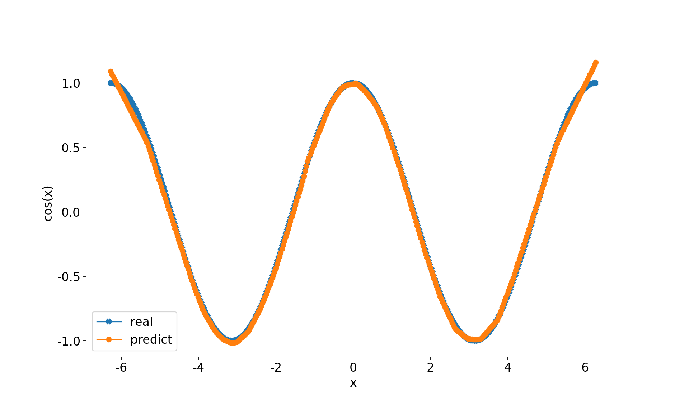

# Practical Pytorch Learning

[readme_zh](./README_zh.md)

## Overview
This project is my journey of learning PyTorch for developing edge vision models, with three sub-projects serving as progressive learning steps:
- Image classification on the CIFAR-10 dataset to master the basic PyTorch workflow
- Deploying the YOLOv5-Lite model on a Raspberry Pi 4 B to achieve real-time object detection at over 30 FPS
- Implementing model quantization and pruning on a Raspberry Pi 4 B to reach ultimate performance of over 35 FPS

## ✨ Progress
- Managed to construct Pytorch environment
- Fit the function cos（x）


## 🚀 Quickstart
If you need these materials to learn, please follow the instruction。**Highly Recommend to install the env with Astral uv**

```bash
# Clone this repo
git clone https://github.com/octpus-01/vision_torch_learn.git

cd vision_torch_learn

# use uv to rebuild the env
uv venv .venv --python 3.12
source .venv/bin/activate
uv sync

# test cos（x）
uv run cos_try.py

# expect to generate cos.png

```

## 📁 Project structure


## 🤝 How to contribute

Welcome everyone to Issue or Pull Request！  
Please make sure to keep the code in the same format and pass the test.

1. Fork the repo
2. Create your branch (`git checkout -b feature/AmazingFeature`)
3. Commit the changes (`git commit -m 'Add some AmazingFeature'`)
4. Push to branch (`git push origin feature/AmazingFeature`)
5. Open Pull Request

