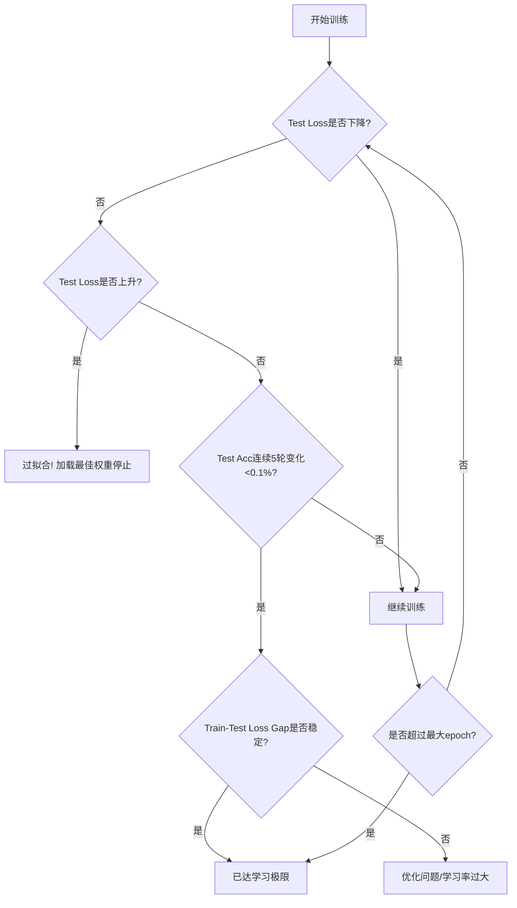

# 🎯 CIFAR-10 图像分类完整实战指南

## 一、项目概述

### 核心目标
1. **数据加载**：使用 `torchvision` 加载 CIFAR-10 数据集（本地路径：`data/cifar10`）
2. **模型构建**：实现三种不同复杂度的 CNN 模型（简单 CNN / ResNet18 / VGG11）
3. **训练监控**：集成 TensorBoard 实时可视化训练过程
4. **性能评估**：掌握模型收敛判断与过拟合识别方法

### 技术栈
- **框架**：PyTorch + torchvision
- **可视化**：TensorBoard
- **数据集**：CIFAR-10（32×32 彩色图像，10 个类别）

---

## 二、数据加载与预处理

### 2.1 核心代码实现

```python
import torch
import torchvision
import torchvision.transforms as transforms

# ========== 数据增强与标准化 ==========
# 训练集：需要数据增强以提高泛化能力
train_transform = transforms.Compose([
    transforms.RandomCrop(32, padding=4),      # 随机裁剪，边缘填充4像素
    transforms.RandomHorizontalFlip(p=0.5),    # 50%概率水平翻转
    transforms.ToTensor(),                      # 转为Tensor并归一化到[0,1]
    transforms.Normalize(
        mean=(0.4914, 0.4822, 0.4465),         # CIFAR-10训练集均值
        std=(0.2470, 0.2435, 0.2616)           # CIFAR-10训练集标准差
    )
])

# 测试集：仅做标准化，不做数据增强
test_transform = transforms.Compose([
    transforms.ToTensor(),
    transforms.Normalize(
        mean=(0.4914, 0.4822, 0.4465),
        std=(0.2470, 0.2435, 0.2616)
    )
])

# ========== 数据集加载 ==========
# 关键参数说明：
# - root: 指向包含 cifar-10-batches-py/ 子目录的父目录
# - download=False: 数据已存在，禁止重新下载
# - train: True=训练集(50000张), False=测试集(10000张)

trainset = torchvision.datasets.CIFAR10(
    root='data/cifar10',        # 确保路径下有 cifar-10-batches-py/ 子目录
    train=True,
    download=False,             # 必须设为False，避免重复下载
    transform=train_transform
)

testset = torchvision.datasets.CIFAR10(
    root='data/cifar10',
    train=False,
    download=False,
    transform=test_transform
)

# ========== DataLoader配置 ==========
trainloader = torch.utils.data.DataLoader(
    trainset,
    batch_size=128,             # 常用批量大小，可根据显存调整
    shuffle=True,               # 每轮打乱数据顺序
    num_workers=2,              # 多进程加载，建议2-4
    pin_memory=True             # 加速GPU数据传输（如果使用CUDA）
)

testloader = torch.utils.data.DataLoader(
    testset,
    batch_size=128,
    shuffle=False,              # 测试集不需要打乱
    num_workers=2
)
```

### 2.2 关键要点解析

| 参数/操作 | 作用 | 注意事项 |
|-----------|------|----------|
| `RandomCrop(32, padding=4)` | 数据增强：随机裁剪32×32区域 | 必须加padding，否则图像尺寸会变小 |
| `Normalize(mean, std)` | 标准化：使数据分布接近N(0,1) | **必须使用CIFAR-10专用统计值**，不能用ImageNet的 |
| `download=False` | 禁止自动下载 | 如果设为True且数据已存在，会报错或重复下载 |
| `num_workers` | 多进程数据加载 | 设为0则使用主进程，调试时建议设为0 |
| `root`路径 | 数据根目录 | 必须包含`cifar-10-batches-py/`子目录，结构如下：<br>`data/cifar10/cifar-10-batches-py/data_batch_1` |

### 2.3 常见目录结构错误

```
❌ 错误结构（缺少子目录）：
data/cifar10/
├── data_batch_1
├── data_batch_2
└── test_batch

✅ 正确结构：
data/cifar10/
└── cifar-10-batches-py/          # 必须这层子目录！
    ├── data_batch_1
    ├── data_batch_2
    ├── data_batch_3
    ├── data_batch_4
    ├── data_batch_5
    ├── test_batch
    └── batches.meta
```

**修复命令**：
```bash
mkdir -p data/cifar10/cifar-10-batches-py
mv data/cifar10/data_batch_* data/cifar10/test_batch data/cifar10/batches.meta data/cifar10/cifar-10-batches-py/
```

---

## 三、模型构建方案（三选一）

### 3.1 方案 A：简单 CNN（适合入门理解）

```python
import torch.nn as nn
import torch.nn.functional as F

class SimpleCNN(nn.Module):
    def __init__(self):
        super(SimpleCNN, self).__init__()
        # 特征提取层
        self.features = nn.Sequential(
            # 输入: 3×32×32 → 输出: 32×32×32
            nn.Conv2d(3, 32, kernel_size=3, padding=1),
            nn.BatchNorm2d(32),           # 批归一化，加速收敛
            nn.ReLU(inplace=True),
            nn.MaxPool2d(2, 2),           # 32×32 → 16×16
            
            # 输入: 32×16×16 → 输出: 64×16×16
            nn.Conv2d(32, 64, kernel_size=3, padding=1),
            nn.BatchNorm2d(64),
            nn.ReLU(inplace=True),
            nn.MaxPool2d(2, 2)            # 16×16 → 8×8
        )
        
        # 分类器
        self.classifier = nn.Sequential(
            nn.Dropout(p=0.5),            # 防止过拟合
            nn.Linear(64 * 8 * 8, 128),   # 展平后: 64通道×8×8空间
            nn.ReLU(inplace=True),
            nn.Dropout(p=0.5),
            nn.Linear(128, 10)            # 10个类别
        )
        
    def forward(self, x):
        x = self.features(x)
        x = torch.flatten(x, 1)           # 从第1维开始展平，保留batch维度
        x = self.classifier(x)
        return x

# ========== 实例化模型（关键！必须加括号） ==========
device = torch.device("cuda" if torch.cuda.is_available() else "cpu")
model = SimpleCNN().to(device)            # ✅ 正确：创建实例后移动设备
# model = SimpleCNN.to(device)            # ❌ 错误：对类调用.to()
```

**结构解析**：
- 输入尺寸：`3×32×32`（3通道，32×32像素）
- 经过2次 `MaxPool2d(2,2)`：空间尺寸 `32→16→8`
- 最终特征图：`64×8×8 = 4096` 维向量
- 参数量：约 20万，适合快速实验

---

### 3.2 方案 B：ResNet18（工业级标准）

```python
import torchvision.models as models

def create_resnet18(num_classes=10, pretrained=False):
    """
    创建适配CIFAR-10的ResNet18
    修改点：
    1. 首层卷积：kernel_size 7→3, stride 2→1, padding 3→1
       （CIFAR-10图像太小，不需要下采样8倍）
    2. 移除maxpool（或改为stride=1）
    3. 全连接层输出改为10类
    """
    model = models.resnet18(pretrained=pretrained)
    
    # 修改首层卷积适配32×32输入
    model.conv1 = nn.Conv2d(
        3, 64, kernel_size=3, stride=1, padding=1, bias=False
    )
    model.maxpool = nn.Identity()  # 移除最大池化（或改为nn.MaxPool2d(1,1)）
    
    # 修改输出层
    model.fc = nn.Linear(model.fc.in_features, num_classes)
    
    return model

# 使用
model = create_resnet18(num_classes=10, pretrained=False).to(device)
```

**关键修改原理**：
- 原始ResNet设计用于224×224的ImageNet
- CIFAR-10仅32×32，若保持`kernel_size=7, stride=2`，信息损失过快
- 改为`kernel_size=3, stride=1`后，特征图尺寸变化：`32→32→16→8→4`（更合理）

---

### 3.3 方案 C：VGG11（经典架构）

```python
def create_vgg11(num_classes=10, pretrained=False):
    """
    创建适配CIFAR-10的VGG11
    VGG特点：连续小卷积(3×3) + 最大池化，结构规整
    """
    model = models.vgg11(pretrained=pretrained)
    
    # 修改首层卷积：适配32×32输入（原为224×224）
    model.features[0] = nn.Conv2d(3, 64, kernel_size=3, padding=1)
    
    # 修改分类器最后一层：4096 → 10
    model.classifier[6] = nn.Linear(4096, num_classes)
    
    return model

# 使用
model = create_vgg11(num_classes=10, pretrained=False).to(device)
```

---

## 四、TensorBoard 训练监控

### 4.1 基础配置

```python
from torch.utils.tensorboard import SummaryWriter
import time

# 创建writer（建议按实验命名）
experiment_name = f"cifar10_resnet18_{time.strftime('%m%d_%H%M')}"
writer = SummaryWriter(log_dir=f'runs/{experiment_name}')

# 可选：记录模型结构
dummy_input = torch.randn(1, 3, 32, 32).to(device)
writer.add_graph(model, dummy_input)
```

### 4.2 训练循环中的记录

```python
def train_epoch(model, loader, criterion, optimizer, epoch, writer, log_interval=100):
    model.train()  # 训练模式（启用BatchNorm/Dropout）
    running_loss = 0.0
    correct = 0
    total = 0
    
    for batch_idx, (inputs, labels) in enumerate(loader):
        inputs, labels = inputs.to(device), labels.to(device)
        
        # 前向传播
        optimizer.zero_grad()           # 必须：清零梯度，防止累加
        outputs = model(inputs)
        loss = criterion(outputs, labels)
        
        # 反向传播
        loss.backward()
        optimizer.step()
        
        # 统计
        running_loss += loss.item()
        _, predicted = outputs.max(1)
        total += labels.size(0)
        correct += predicted.eq(labels).sum().item()
        
        # 每log_interval步记录一次（避免日志过于频繁）
        global_step = epoch * len(loader) + batch_idx
        if batch_idx % log_interval == 0:
            writer.add_scalar('Train/Loss', loss.item(), global_step)
            writer.add_scalar('Train/Accuracy', 100.*correct/total, global_step)
            
            # 记录学习率
            current_lr = optimizer.param_groups[0]['lr']
            writer.add_scalar('Train/Learning_Rate', current_lr, global_step)
    
    # 返回epoch平均指标
    epoch_loss = running_loss / len(loader)
    epoch_acc = 100. * correct / total
    return epoch_loss, epoch_acc
```

### 4.3 评估与记录

```python
def evaluate(model, loader, criterion, epoch, writer, tag='Test'):
    model.eval()  # 评估模式（冻结BatchNorm/Dropout）
    total_loss = 0.0
    correct = 0
    total = 0
    
    with torch.no_grad():  # 禁用梯度计算，节省内存
        for inputs, labels in loader:
            inputs, labels = inputs.to(device), labels.to(device)
            outputs = model(inputs)
            loss = criterion(outputs, labels)
            
            total_loss += loss.item() * inputs.size(0)  # 加权平均
            _, predicted = outputs.max(1)
            total += labels.size(0)
            correct += predicted.eq(labels).sum().item()
    
    avg_loss = total_loss / total
    accuracy = 100. * correct / total
    
    # 记录到TensorBoard
    writer.add_scalar(f'{tag}/Loss', avg_loss, epoch)
    writer.add_scalar(f'{tag}/Accuracy', accuracy, epoch)
    
    return avg_loss, accuracy
```

### 4.4 启动 TensorBoard

```bash
# 终端运行
tensorboard --logdir=runs --port=6006

# 访问 http://localhost:6006
# 建议面板布局：
# - 上方：Train/Test Loss 对比曲线
# - 下方：Train/Test Accuracy 对比曲线
# - 右侧：Learning Rate 变化
```

---

## 五、如何判断模型是否达到学习极限

### 5.1 核心监控指标（按重要性排序）

| 指标 | 观察重点 | 判断标准 |
|------|----------|----------|
| **Test Loss** | 是否持续下降或开始上升 | 连续5-10轮不降 → 可能收敛；<br>开始上升 → 过拟合，立即停止 |
| **Test Accuracy** | 波动范围与趋势 | 连续5轮变化<0.1% → 可能收敛 |
| **Train-Test Loss Gap** | 差距是否持续扩大 | Gap > 1.0 且扩大 → 严重过拟合 |
| **Gradient Norm** | 梯度范数是否趋近于0 | < 1e-5 且稳定 → 到达局部最优 |

### 5.2 典型曲线解读

```
理想情况（正常收敛）：
Train Loss:  ████░░░░░░░░░░░░░░░░  持续下降
Test Loss:   ████░░░░░░░░░░░░░░░░  同步下降，最终平稳
Test Acc:    ░░░░██████░░░░░░░░░░  快速上升后平稳

过拟合（需要正则化/早停）：
Train Loss:  ████████████████░░░░  接近0
Test Loss:   ████░░░░░░░░▓▓▓▓▓▓▓▓  先降后升（▓表示上升）
Test Acc:    ░░░░████░░░░▓▓▓▓▓▓▓▓  达到峰值后下降

欠拟合（模型容量不足）：
Train Loss:  ████████░░░░░░░░░░░░  下降后停滞在较高值
Test Loss:   ████████░░░░░░░░░░░░  与Train Loss接近但都不低
Test Acc:    ░░░░██░░░░░░░░░░░░░░  远低于该模型应有水平（如ResNet18<85%）
```

### 5.3 决策流程



### 5.4 CIFAR-10 性能基准参考

| 模型 | 预期准确率 | 典型收敛epoch | 关键瓶颈 |
|------|------------|---------------|----------|
| SimpleCNN | 70% - 78% | 30-50 | 模型容量不足（参数量少） |
| VGG11 | 88% - 91% | 80-150 | 梯度消失/计算量大 |
| ResNet18 | 92% - 94% | 100-200 | 需要充分训练 |
| ResNet50 | 93% - 95% | 150-300 | 容易过拟合，需强正则化 |
| **人类水平** | **~94%** | - | - |
| **当前SOTA** | **96%+** | - | 使用复杂架构+数据增强 |

> **判断原则**：如果你的 ResNet18 训练 200 epoch 后准确率 < 90%，大概率是代码/超参问题，而非模型极限。

---

## 六、常见错误与解决方案

### 6.1 致命错误（必现报错）

| 错误现象 | 根本原因 | 解决方案 |
|----------|----------|----------|
| `AttributeError: 'torch.device' object has no attribute '_apply'` | 对类而非实例调用 `.to()` | `model = SimpleCNN().to(device)` 加括号 |
| `FileNotFoundError: CIFAR10 data not found` | 目录结构错误 | 确保路径为 `root/data/cifar-10-batches-py/` |
| `RuntimeError: CUDA out of memory` | 显存不足 | 减小 `batch_size`（如128→64） |
| `ValueError: Expected input batch_size (X) to match target batch_size (Y)` | 标签维度不匹配 | 检查 `criterion(outputs, labels)`，labels应为LongTensor |

### 6.2 隐蔽错误（训练能跑但效果差）

| 现象 | 原因 | 检查点 |
|------|------|--------|
| 训练loss不降 | 学习率过大/梯度消失 | 尝试 `lr=0.0001`；检查BatchNorm是否启用 |
| 测试准确率始终<60% | 忘记标准化或标准化参数错误 | 确认使用CIFAR-10专用mean/std |
| 训练loss很低但测试loss很高 | 忘记 `model.eval()` | 评估前必须调用！ |
| 每轮训练结果波动极大 | 忘记 `optimizer.zero_grad()` | 导致梯度累加 |
| TensorBoard无数据 | 路径错误或权限问题 | 检查 `log_dir` 是否存在，使用绝对路径 |

---

## 七、进阶优化建议

### 7.1 进一步提升性能

1. **数据增强增强**：
   ```python
   transforms.RandomRotation(15),          # 随机旋转
   transforms.ColorJitter(brightness=0.2, contrast=0.2),  # 颜色抖动
   transforms.RandomErasing(p=0.5),        # 随机擦除（需配合ToTensor后）
   ```

2. **学习率预热（Warmup）**：
   ```python
   from torch.optim.lr_scheduler import LambdaLR
   
   def warmup_scheduler(epoch):
       if epoch < 5:
           return epoch / 5
       return 1
   
   scheduler = LambdaLR(optimizer, lr_lambda=warmup_scheduler)
   ```

3. **标签平滑（Label Smoothing）**：
   ```python
   criterion = nn.CrossEntropyLoss(label_smoothing=0.1)
   ```

4. **模型集成（Ensemble）**：
   - 训练3个不同初始化的ResNet18
   - 预测时取平均

### 7.2 调试 checklist

- [ ] 数据加载：打印 `trainset[0]` 确认图像尺寸为32×32，标签为0-9整数
- [ ] 模型输出：确认 `model(torch.randn(2,3,32,32)).shape` 为 `torch.Size([2, 10])`
- [ ] 设备一致性：确认 `inputs.device == model.device == labels.device`
- [ ] 梯度检查：确认 `model.conv1.weight.grad` 非None且值合理（非NaN/Inf）

---

## 八、总结

本指南涵盖了从数据加载到模型部署的完整流程，核心要点：

1. **数据**：正确的目录结构 + CIFAR-10专用标准化参数
2. **模型**：三种方案由浅入深，ResNet18是性价比最高的选择
3. **训练**：必须区分 `train()`/`eval()`，定期记录TensorBoard
4. **判断**：以 **Test Loss** 为主要收敛指标，结合 Test Accuracy 综合判断
5. **调试**：遇到问题时，先检查设备、维度、模式切换这三要素

> 💡 **下一步建议**：先用 SimpleCNN 跑通完整流程（约30分钟），观察TensorBoard曲线理解训练动态，再切换到 ResNet18 追求更高精度。