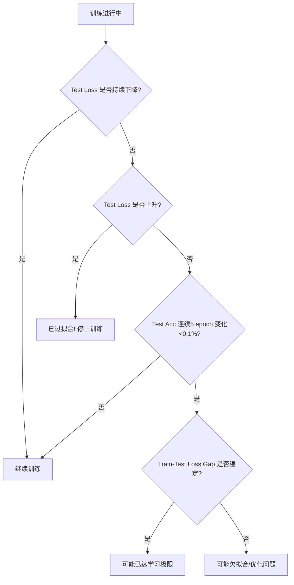

以下是针对 CIFAR-10 分类任务的**关键代码指南**，专注于**框架基础操作**。我将提供**核心代码片段**和**详细指导**，帮助你理解 PyTorch 和 TensorBoard 的工作流程，**不提供完整代码**，而是教你如何构建自己的代码。

---

### 📌 核心目标
1. 加载 CIFAR-10 数据集（已存放在 `data/cifar10`）
2. 实现 3 种不同模型（简单 CNN / ResNet18 / VGG11）
3. 用 TensorBoard 实时监控训练过程
4. 掌握 PyTorch 视觉任务基础操作

---

## 🔧 关键代码部分与编写指南

### ✅ 1. 数据加载（核心：`torchvision.datasets`）
**为什么重要**：CIFAR-10 是标准视觉数据集，数据加载是第一步。

```python
import torchvision
import torchvision.transforms as transforms

# 1. 定义数据转换（关键！）
transform = transforms.Compose([
    transforms.RandomCrop(32, padding=4),  # 数据增强
    transforms.RandomHorizontalFlip(),     # 随机翻转
    transforms.ToTensor(),
    transforms.Normalize((0.4914, 0.4822, 0.4465), (0.2470, 0.2435, 0.2616))  # 标准化
])

# 2. 加载数据集（注意 root 路径！）
trainset = torchvision.datasets.CIFAR10(
    root='train/cifar10',  # 你的数据目录
    train=True,
    download=False,       # 已存在，不下载
    transform=transform
)

testset = torchvision.datasets.CIFAR10(
    root='train/cifar10',
    train=False,
    download=False,
    transform=transform
)

# 3. 创建 DataLoader（关键：batch_size 和 shuffle）
trainloader = torch.utils.data.DataLoader(
    trainset,
    batch_size=128,       # 常用值
    shuffle=True,         # 打乱数据
    num_workers=2         # 多进程加载
)
```

**📌 指导**：
- `transforms` 是**数据预处理核心**，必须做标准化
- `root` 路径必须指向你存放数据的目录
- `download=False` **必须**，因为数据已存在
- `num_workers` 根据 CPU 核心数调整（2-4）

---

### ✅ 2. 模型方案（3 种选择，选一种即可）
#### 方案 A: 简单 CNN（适合入门）
```python
class SimpleCNN(nn.Module):
    def __init__(self):
        super().__init__()
        self.features = nn.Sequential(
            nn.Conv2d(3, 32, 3, padding=1),  # 3通道输入，32个卷积核
            nn.ReLU(),
            nn.MaxPool2d(2, 2),
            nn.Conv2d(32, 64, 3, padding=1),
            nn.ReLU(),
            nn.MaxPool2d(2, 2)
        )
        self.classifier = nn.Sequential(
            nn.Linear(64 * 8 * 8, 128),  # 64通道 * 8x8特征图
            nn.ReLU(),
            nn.Linear(128, 10)            # 10类输出
        )

    def forward(self, x):
        x = self.features(x)
        x = x.view(x.size(0), -1)  # 展平
        return self.classifier(x)
```

**📌 指导**：
- 输入尺寸：32×32×3 → 经过两次 MaxPool 后变成 8×8×64
- `nn.Conv2d` 参数：`(输入通道, 输出通道, 卷积核大小)`
- `view(-1)` 是**关键操作**：将特征图展平为向量

---

#### 方案 B: ResNet18（工业级选择）
```python
# 使用预训练模型（但不加载预训练权重）
model = torchvision.models.resnet18(pretrained=False)

# 修改输入层（CIFAR-10 是 32x32，原 ResNet 为 224x224）
model.conv1 = nn.Conv2d(3, 64, kernel_size=3, stride=1, padding=1, bias=False)

# 修改输出层（10类）
model.fc = nn.Linear(model.fc.in_features, 10)
```

**📌 指导**：
- `pretrained=False`：不加载 ImageNet 预训练权重（CIFAR-10 用不到）
- `model.conv1` 修改：因为输入尺寸小，步长改为 1
- `model.fc` 修改：输出层从 1000 类 → 10 类

---

#### 方案 C: VGG11（经典选择）
```python
model = torchvision.models.vgg11(pretrained=False)
model.features[0] = nn.Conv2d(3, 64, kernel_size=3, padding=1)  # 修改输入层
model.classifier[6] = nn.Linear(4096, 10)  # 修改输出层
```

**📌 指导**：
- `vgg11` 的 `features` 和 `classifier` 结构固定
- `features[0]` 是第一个卷积层（输入通道改为 3）
- `classifier[6]` 是最后一个全连接层（输出 10 类）

---

### ✅ 3. TensorBoard 监控（核心：`SummaryWriter`）
```python
from torch.utils.tensorboard import SummaryWriter

# 1. 初始化 writer（日志目录）
writer = SummaryWriter(log_dir='runs/cifar10_resnet18')

# 2. 在训练循环中记录
for epoch in range(epochs):
    for batch_idx, (inputs, labels) in enumerate(trainloader):
        # ... 前向传播、计算损失、反向传播 ...
        
        # 记录训练损失
        writer.add_scalar('Loss/train', loss.item(), epoch * len(trainloader) + batch_idx)
        
        # 记录学习率
        writer.add_scalar('LR', optimizer.param_groups[0]['lr'], epoch * len(trainloader) + batch_idx)

    # 每个 epoch 结束，记录测试准确率
    test_acc = evaluate(model, testloader)
    writer.add_scalar('Accuracy/test', test_acc, epoch)
```

**📌 指导**：
- `log_dir`：指定 TensorBoard 日志路径
- `add_scalar`：记录标量数据（loss、accuracy、lr）
- **关键点**：`global_step` 参数是**累计步数**（`epoch * len(loader) + batch_idx`）
- 测试准确率在**每个 epoch 结束时**记录

---

### ✅ 4. 训练循环（关键：优化器和损失函数）
```python
# 1. 选择模型（例如 ResNet18）
model = model.to(device)  # 移到 GPU

# 2. 定义优化器（Adam 适合图像任务）
optimizer = torch.optim.Adam(model.parameters(), lr=0.001)

# 3. 定义损失函数
criterion = nn.CrossEntropyLoss()

# 4. 训练循环（核心）
for epoch in range(epochs):
    model.train()
    for inputs, labels in trainloader:
        inputs, labels = inputs.to(device), labels.to(device)
        
        optimizer.zero_grad()
        outputs = model(inputs)
        loss = criterion(outputs, labels)
        loss.backward()
        optimizer.step()
```

**📌 指导**：
- `device = torch.device("cuda" if torch.cuda.is_available() else "cpu")`：**必须**判断 GPU 可用性
- `optimizer.zero_grad()`：**每次训练前必须清零梯度**
- `model.train()`：**训练模式**（影响 BatchNorm/ Dropout）
- `criterion = nn.CrossEntropyLoss()`：**分类任务标准损失**

---

### ✅ 5. 评估函数（关键：准确率计算）
```python
def evaluate(model, dataloader):
    model.eval()  # 评估模式
    correct = 0
    total = 0
    with torch.no_grad():  # 关闭梯度计算
        for inputs, labels in dataloader:
            inputs, labels = inputs.to(device), labels.to(device)
            outputs = model(inputs)
            _, predicted = torch.max(outputs.data, 1)
            total += labels.size(0)
            correct += (predicted == labels).sum().item()
    return correct / total
```

**📌 指导**：
- `model.eval()`：**必须**切换到评估模式
- `torch.no_grad()`：**节省内存**，不计算梯度
- `torch.max(outputs, 1)`：获取预测类别（每行最大值的索引）

---

## 🚀 你的工作流程指南

1. **选择一种模型**（从 3 种中选 1 种）
2. **按指导写数据加载**（注意 `root` 路径和 `download=False`）
3. **实现训练循环**（包含 `optimizer.zero_grad()` 和 `loss.backward()`）
4. **加入 TensorBoard 记录**（`writer.add_scalar`）
5. **实现评估函数**（计算准确率）
6. **启动 TensorBoard**：
   ```bash
   tensorboard --logdir=runs
   ```
   → 打开浏览器访问 `http://localhost:6006`

---

## 💡 为什么这样设计？

| 操作 | 为什么重要 | 你学到的 |
|------|------------|----------|
| 数据增强 | 提高泛化能力 | 视觉任务必备 |
| `view(-1)` | 特征图展平 | 神经网络基础 |
| `optimizer.zero_grad()` | 防止梯度累加 | 深度学习关键 |
| `model.train()`/`eval()` | 模式切换 | 模型正确使用 |
| `torch.no_grad()` | 节省内存 | 高效训练 |

---

## ❌ 常见错误避免

1. **数据路径错误** → 检查 `root='train/cifar10'`
2. **忘记标准化** → CIFAR-10 必须用 `(0.4914, 0.4822, 0.4465)` 标准化
3. **不调用 `zero_grad()`** → 梯度累加导致训练失败
4. **忘记切换 `train()`/`eval()`** → BatchNorm 用错模式
5. **未指定 `download=False`** → 会尝试下载数据（失败）

---

## ✅ 你将掌握的核心技能

1. 使用 `torchvision` 加载视觉数据集
2. 构建 CNN 模型（卷积层 → 全连接层）
3. 使用预训练模型（ResNet/VGG）并修改
4. 用 TensorBoard 监控训练过程
5. 正确使用 `train()`/`eval()` 和 `no_grad()`

> 💡 **下一步**：尝试更换模型（从 SimpleCNN → ResNet18），观察 TensorBoard 中的 loss 曲线变化，理解**模型复杂度对训练的影响**。


这是一个非常好的问题！你提到的 **“像官网 Toronto 一样用 pickle 导入 CIFAR-10”**，其实正是 **CIFAR-10 官方原始数据格式**。下面我来详细解释：

---

### ✅ 一、CIFAR-10 的两种常见格式

#### 1. **官方原始格式（Toronto 格式）**
- 由 [Alex Krizhevsky](https://www.cs.toronto.edu/~kriz/cifar.html) 发布
- 数据以 **Python `pickle` 文件** 存储（`.pkl` 或 `.bin`）
- 每个文件包含字典：`{'data': ..., 'labels': ...}`
- **需要手动用 `pickle` 读取**

#### 2. **PyTorch `torchvision.datasets.CIFAR10` 格式**
- PyTorch 封装好的接口
- **内部会自动处理 pickle 文件**
- 你只需调用 `CIFAR10(root=..., download=True)`，它会：
  - 下载官方 pickle 文件（如果不存在）
  - 自动解压并解析
  - 返回 `PIL.Image` + `int label`

> 🔑 **关键结论**：  
> **你完全可以像 Toronto 官网那样用 `pickle` 直接读取**，但 **`torchvision.datasets.CIFAR10` 已经为你做了这件事**！

---

### ✅ 二、为什么你“不能用 pickle 像官网一样导入”？

很可能是因为 **你的数据目录结构不对**。

#### 📂 正确的 Toronto 格式目录结构应为：
```
train/cifar10/
├── cifar-10-batches-py/
│   ├── data_batch_1
│   ├── data_batch_2
│   ├── ...
│   ├── test_batch
│   └── batches.meta
```

> ⚠️ 注意：**必须有一个 `cifar-10-batches-py/` 子目录**！  
> 这是官方压缩包解压后的标准结构。

#### ❌ 如果你只有：
```
train/cifar10/
├── data_batch_1
├── test_batch
└── ...
```
→ **缺少 `cifar-10-batches-py/` 目录** → `torchvision` 会报错！

---

### ✅ 三、解决方案：两种方式任选

---

#### ✅ 方案 A：**让 `torchvision` 正常工作（推荐）**

1. **确保目录结构正确**：
   ```bash
   # 你的数据应该在这里：
   ls train/cifar10/cifar-10-batches-py/
   # 应看到 data_batch_1, test_batch 等
   ```

2. **代码中设置 `download=False`**：
   ```python
   trainset = torchvision.datasets.CIFAR10(
       root='train/cifar10',  # 指向父目录！
       train=True,
       download=False,       # 不下载，用本地数据
       transform=transform
   )
   ```
   > 💡 `root` 是 **包含 `cifar-10-batches-py/` 的目录**，不是直接指向 batch 文件！

---

#### ✅ 方案 B：**手动用 `pickle` 读取（理解原理）**

如果你想知道 Toronto 官网是怎么做的，可以这样写：

```python
import pickle
import numpy as np
from PIL import Image

def unpickle(file):
    with open(file, 'rb') as fo:
        dict = pickle.load(fo, encoding='bytes')
    return dict

# 读取一个 batch
batch = unpickle('train/cifar10/cifar-10-batches-py/data_batch_1')

# 提取数据
data = batch[b'data']        # shape: (10000, 3072)
labels = batch[b'labels']    # list of 10000 ints

# 转换为图像 (32x32x3)
images = data.reshape(-1, 3, 32, 32).transpose(0, 2, 3, 1)  # NHWC

# 转为 PIL Image（才能用 transforms）
pil_images = [Image.fromarray(img) for img in images]
```

> 🔍 这就是 `torchvision.datasets.CIFAR10` 内部做的事情！

---

### ✅ 四、验证你的数据是否有效

运行以下代码检查：

```python
import torchvision
from torchvision.datasets import CIFAR10

try:
    dataset = CIFAR10(root='train/cifar10', train=True, download=False)
    print(f"✅ 成功加载 {len(dataset)} 张训练图像")
    print(f"第一张图类型: {type(dataset[0][0])}")  # 应该是 <class 'PIL.Image.Image'>
except Exception as e:
    print(f"❌ 加载失败: {e}")
```

如果报错：
- `FileNotFoundError` → 目录结构错误
- `EOFError` → pickle 文件损坏
- `UnicodeDecodeError` → 编码问题（需加 `encoding='bytes'`）

---

### ✅ 五、总结：你应该怎么做？

| 你的情况 | 推荐做法 |
|--------|--------|
| **想快速训练** | ✅ 用 `torchvision.datasets.CIFAR10` + 正确目录结构 |
| **想理解底层原理** | ✅ 手动写 `unpickle` 函数（如上） |
| **数据目录不对** | 🔧 把所有 batch 文件放进 `cifar-10-batches-py/` 子目录 |

> 🌟 **最佳实践**：  
> **使用 `torchvision.datasets.CIFAR10`**，因为它：
> - 自动处理 pickle 解析
> - 支持 `transforms`
> - 兼容 DataLoader
> - 避免手动内存管理

---

### 🔧 附：如何修复目录结构？

如果你的数据直接放在 `train/cifar10/` 下（没有子目录），执行：

```bash
mkdir -p train/cifar10/cifar-10-batches-py
mv train/cifar10/data_batch_* train/cifar10/test_batch train/cifar10/batches.meta train/cifar10/cifar-10-batches-py/
```

然后你的代码就能正常工作了！

---

现在你应该明白：**不是不能用 pickle，而是 `torchvision` 已经帮你用了**，你只需要提供正确的目录结构即可 😊

🔥 核心错误分析
python

编辑


# 错误代码：
model = SimpleCNN.to(DEVICE)
问题：
SimpleCNN 是一个类（class），不是实例！你不能对类调用 .to()。
✅ 正确做法：先创建实例，再移动到设备。
python

编辑


model = SimpleCNN().to(DEVICE)  # ← 注意括号 () 创建实例
💡 这就是报错 AttributeError: 'torch.device' object has no attribute '_apply' 的原因 —— Python 把 DEVICE 当成了 self 参数传给了 to() 方法。

📌 关键知识点总结
.to(DEVICE) 必须作用于模型实例，不是类
训练/测试变换要分开：测试集不能做 RandomCrop/Flip
torch.flatten(x, 1) 比 x.view(x.size(0), -1) 更安全
TensorBoard 日志不要每步都写（会变慢），建议每 N 步或每 epoch
始终使用 model.train() / model.eval() 切换模式


这是一个**非常核心且深刻的问题**，涉及到深度学习训练中的**收敛判断、过拟合识别和性能瓶颈分析**。你的直觉（“测试准确率变化小”）是正确的起点，但**仅靠这一点远远不够**。

下面我将系统性地告诉你：**如何科学判断网络是否达到学习极限？**

---

## ✅ 一、什么是“学习极限”？

> **学习极限 = 模型在当前架构、数据、优化策略下所能达到的最佳泛化性能**

它不等于 100% 准确率！CIFAR-10 的人类水平约 94%，SOTA 模型可达 96~97%，简单 CNN 可能只有 70~80%。

---

## 🔍 二、判断学习极限的 **5 个关键信号**（按重要性排序）

### 📌 1. **测试损失（Test Loss）不再下降，甚至开始上升** ← **最可靠指标！**
- ✅ **理想情况**：训练 loss ↓，测试 loss ↓ → 模型在学习
- ⚠️ **达到极限**：训练 loss 继续 ↓，但**测试 loss 停滞或上升** → **过拟合开始**
- ❌ **严重过拟合**：训练 loss ≈ 0，测试 loss 很高

> 💡 **为什么看 loss 而不是 accuracy？**  
> Accuracy 是离散指标（0/1），对微小变化不敏感；Loss 是连续值，更能反映模型置信度。

#### ✅ 监控建议：
```python
# 在 TensorBoard 中同时记录
writer.add_scalar('Loss/train', train_loss, epoch)
writer.add_scalar('Loss/test', test_loss, epoch)  # ← 关键！
```

---

### 📌 2. **测试准确率（Test Accuracy）连续多个 epoch 变化 < 0.1%**
- 连续 5~10 个 epoch，测试准确率波动在 ±0.1% 内
- 且没有明显上升趋势（可用滑动平均判断）

> ⚠️ 注意：**不要只看最后几个点**！可能只是暂时平台期，后面还会涨。

#### ✅ 实践技巧：
- 计算最近 5 个 epoch 的准确率标准差
- 如果 `std < 0.001`（即 0.1%），可认为收敛

---

### 📌 3. **训练损失与测试损失的 gap 稳定或扩大**
- 初始阶段：train loss > test loss（正常）
- 中期：两者同步下降
- **达到极限时**：train loss 继续降，test loss 不动 → **gap 扩大**

> 📊 在 TensorBoard 中画两条 loss 曲线，观察 gap！

---

### 📌 4. **梯度范数（Gradient Norm）趋近于 0**
- 当模型接近极小值点时，梯度会变得非常小
- 可监控 `torch.norm(param.grad)` 的平均值

```python
total_norm = 0
for p in model.parameters():
    if p.grad is not None:
        total_norm += p.grad.data.norm(2).item()
writer.add_scalar('GradNorm', total_norm, step)
```
- 如果 `GradNorm < 1e-5` 且稳定 → 可能已收敛

---

### 📌 5. **验证集性能长时间无法超越 SOTA 或理论上限**
- 例如：CIFAR-10 上 ResNet-18 的典型准确率是 ~94%
- 如果你的 ResNet-18 训了 200 epoch 还只有 85%，可能是：
  - 数据预处理错误
  - 学习率不合适
  - 模型实现 bug
  - **而非“已达极限”**

> ✅ **先确认 baseline 是否合理！**

---

## 🚫 三、常见误判（你必须避免！）

| 误判 | 真相 |
|------|------|
| “训练 loss 很低 = 学得好” | 可能严重过拟合！必须看 test loss |
| “准确率三天没涨 = 收敛了” | 可能是学习率太大，卡在局部最优 |
| “loss 震荡 = 不行了” | 可能是 batch size 太小，正常现象 |

---

## 🛠️ 四、实用决策流程图



---

## 🔧 五、进阶技巧：主动探测极限

### 1. **学习率扫描（LR Finder）**
- 用小范围数据，从 `1e-6` 到 `1` 扫描 lr
- 找到 loss 下降最快的 lr → 可能突破当前瓶颈

### 2. **早停（Early Stopping）**
```python
from torch.optim.lr_scheduler import ReduceLROnPlateau

scheduler = ReduceLROnPlateau(optimizer, mode='max', patience=5, factor=0.5)
# 当 test acc 5 epoch 不提升，lr 减半
```

### 3. **模型容量检查**
- 如果简单模型（如你的 SimpleCNN）很快饱和（~75%）
- 尝试更大模型（ResNet18）→ 如果还能提升，说明原模型 capacity 不足

---

## 📊 六、CIFAR-10 典型性能参考

| 模型 | 合理测试准确率 | 达到极限的 epoch |
|------|----------------|------------------|
| SimpleCNN（你的结构） | 70% ~ 78% | 30~50 epoch |
| ResNet-18 | 92% ~ 94% | 100~200 epoch |
| VGG-11 | 90% ~ 92% | 80~150 epoch |

> 💡 如果你的 SimpleCNN 在 50 epoch 后 test acc 停在 75% 不动，**很可能已达该模型的学习极限**。

---

## ✅ 总结：何时停止训练？

| 条件 | 行动 |
|------|------|
| ✅ **Test Loss 连续 5 epoch 不降 + Test Acc 波动 < 0.1%** | 可停止 |
| ✅ **Test Loss 开始上升** | 立即停止（过拟合） |
| ❌ 仅 Train Loss 很低 | 继续训练 |
| ❌ Test Acc 单次 epoch 不涨 | 继续观察 |

> 🌟 **终极建议**：  
> **永远以 Test Loss 为主要指标，Test Accuracy 为辅助，两者结合判断**。  
> 并在 TensorBoard 中**同时监控 train/test 的 loss 和 accuracy**！

这样你就能科学地判断：到底是“学不动了”，还是“还能再抢救一下” 😊